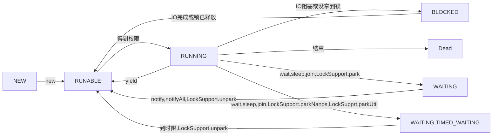

# 深入理解Java虚拟机——读书笔记

## 高效并发

### 为什么要有多线程

计算机的CPU速度、内存读写速度、IO速度和网络通信速度差异过大，单线程会导致大量硬件源无法被充分利用。所以有了并发，但也引入了线程问题。

### 缓存一致性问题的由来

CPU速度大大超过内存读写的速度，为了解决这个问题，硬件加入了高速缓存来提高CPU访问内存数据的速度，但也导致了缓存一致性的问题

### Java内存模型

#### 为什么要有Java内存模型

不同的操作系统和硬件有不同的对内存的访问策略，而Java是跨平台语言，必须保证Java程序在不同环境下对内存的访问规则一致。

#### 主内存与工作内存

主内存和工作内存的最大的区别在于主内存所有线程可见，而工作内存则是线程私有。这样的抽象方式屏蔽了硬件和操作系统的实现细节而高度概括了JVM所关注的关键差异

#### 内存的交互操作

| 指令   | 作用于   | 说明                                                         | 备注                     |
| ------ | -------- | ------------------------------------------------------------ | ------------------------ |
| lock   | 主内存   | 给主内存变量加锁，使其成为线程独占状态                       |                          |
| unlock | 主内存   | 给主内存变量加锁，脱离线程独占状态                           |                          |
| read   | 主内存   | 读取主内存变量到工作内存                                     | read和load同时使用       |
| load   | 工作内存 | 加载read到的变量至工作内存                                   | ead和load同时使用        |
| use    | 工作内存 | 将工作内存中的变量的值传递给执行引擎，jvm遇到需要使用变量的值的时候都需要执行该指令 |                          |
| assign | 工作内存 | 将执行引擎接收到的值赋值给工作内存的变量                     |                          |
| store  | 工作内存 | 将工作内存中变量的值传递到主内存                             | store和write必须同时使用 |
| write  | 主内存   | 将store传递的值写入主内存变量                                | store和write必须同时使用 |

注意事项：

- read和load、store和write禁止单独出现
- assign过的变量必须同步会主内存
- 未经assign的变量禁止同步至主内存
- 新变量只能在主内存中诞生，工作内存不允许使用未初始化的变量
- 一个变量同一时刻只能由一条线程对其进行lock，但lock可重复执行多次，多次lock后必须执行相同次数的unlock变量才能解锁
- lock一个变量将会清空工作内存中此变量的值，若线程要使用需要重新read和load或者use、assign
- 不能unlock没有被lock的变量，也不能unlock一个被其他线程lock的变量
- unlock一个变量之前，必须先将其同步会主内存

PS：

- 以上变量指静态变量、队中的对象等所有线程可见的所有的共享数据，局部变量等线程安全的变量不在范围内

#### 对于``volatile``性变量的特殊规则

##### 被``volatile``修饰的变量的特点

- 可见性：一个线程修改了被``volatile``修饰的变量，其它线程立即可知
- 有序性：禁止指令重排序优化

##### Java内存模型对被``volatile``修饰的变量的特殊规则

- 对于变量V，必须先read&load之后才能使用use，确保确保线程都能从主内存中拿到最新值
- 对于变量V，assign之后必须有store＆write，确保线程对变量的修改能实时同步到主内存
- 如果对变量V的use和assign先于对变量W的use和assign，那么对变量V的read/load和store/write先于对变量W的read/load和store/write，确保了该变量不会被指令重排序优化

##### 其他

###### 可以保障``volatile``修饰的变量线程安全的场景

- 若运算结果不依赖变量的当前值，或能够全部只有单一线程修改变量的值
- 变量不需要于其他的状态变量共同参与不变约束

###### ``volatile``的实现bug

jdk1.5之前，被``volatile``修饰的变量不能保证可见性，后该bug在jdk1.5版本中被修复，也是这个bug导致了双检锁实现的单例模式在1.5之前的版本中不能保证单例

###### 内存屏障

通过加锁一个空操作使缓存失效

#### 对于long和double型变量的特殊规则

以上提到的8个内存交互指令，都是具有原子性的，但对于long和double等64位的数据，jvm允许将没被``volatile``修饰的long和double变量分成两次32位的操作，也就是JVM规范不保证其原子性，不过目前主流的商用JVM实现都保障了long和double的原子性

#### 原子性、可见性和有序性

##### 原子性

###### 什么是原子性

不可分割的，要么一起成功要么一起失败的操作叫做原子性操作

###### Java中有哪些操作是原子性的

- ``read`` ``load`` ``assign`` ``use`` ``store`` ``write`` 满足原子性操作，可以认为基本变量的操作都满足（double和long类型JVM规范不保证满足，但JVM实现上大多做到了满足）
- ``synchronized``可保证原子性

##### 可见性

###### 什么是可见性

指一个线程可以实时且正确地看到另一个线程对变量地修改

###### 哪些方案解决了可见性问题

- ``synchronized`` ``final`` ``volatile`` 解决了变量可见性问题

##### 有序性

###### 什么是有序性

特指多线程环境下，指令执行有序，不会得到错误地结果

###### 解决方案

- ``synchronized``  ``volatile`` 解决了有序性问题

#### 先行发生原则

##### 定义

由jvm内存模型定义的两个操作之间的偏序关系，如果操作A先行发生于操作B，则操作A中的的影响（包括对变量的修改，发送的消息，方法的调用等）均能被B观察到。

##### 规则

- 程序次序规则：在一个线程内，写在前面的操作均先行发生于写在后面的操作
- 管程锁定规则：unlock操作先行发生于后面对同一个锁的lock操作
- 对volatile变量的特殊规则：``volatile``变量的写操作先行发生于对其的读操作
- 线程启动规则：线程的``start()``方法先行发生于该线程的每一个动作
- 线程终止规则：线程的所有动作都先行发生于对该线程的终止检测，如``Thread.join()``、``Thread.isAlive()``
- 线程中断规则：线程的``interrupt()``方法先行发生于线程代码检测到中断事件发生
- 对象终结规则：一个对象的初始化操作``new``先行发生于其``finalize()``
- 传递性：若A先行发生于B，且B先行发生于C，则A先行发生于C

### Java与线程

#### 并发和多线程的关系

多线程不等于并发，是并发的实现方案之一，PHP中还有以多进程实现的并发方案。

#### 线程的实现

- 内核线程：由操作系统内核支持的线程，操作系统会提供“轻量级进程”作为高级接口供程序使用。优点是底层提供支持，效率高，缺点是来回在用户态和内核态之间切换的底层操作太消耗硬件资源。一个轻量级进程对应一个内核线程
- 用户线程：广义指除了内核线程以外的线程，狭义指完全建立在用户空间，内核不能感知的线程存在的实现（即完全由框架实现的线程）。一个CPU对应多个用户线程。优点是用户线程完全就在用户态中，不需要切换内核态，更快速且低消耗。缺点是没有内核支持，实现复杂。
- 用户线程与轻量级进程混合：用户线程执行任务，轻量级进程链接内核线程和用户线程。混合实现的方式平衡了两者的优缺点。

#### Java线程的实现

- 1.2之前完全使用用户线程，1.2使用了内核线程，当前版本实现方式由操作系统决定，仅对并发规模和操作成本有影响，对程序来说感知不到差异

#### Java线程调度

- 协同式线程调度：由线程控制执行时间，执行完毕需要主动通知系统切换线程
  - 优点：
    - 实现简单
    - 并发问题相对更可控
  - 缺点
    - 不通知的话可能一直阻塞
- 抢占式线程调度
  - 优点
    - 线程执行时间系统可控，不会一直阻塞
- 线程优先级
  - 不强制地软性地控制线程被执行地可能。仅作参考，不是绝对优先

#### 线程状态

### 线程安全

#### 什么是线程安全

多线程场景下，在无需额外同步的情况下，对一个对象的访问和操作符合以下两个条件，则该对象是线程安全的

- 对该对象的所有操作都同时满足原子性、可见性和有序性。保证了对象本身是安全的。
- 调用方对该对象的协同操作能得到正确的结果。保证了外部对该对象的协同操作是安全的。

#### Java中线程安全的分类

按安全程度由强到弱分为一下几类

- 不可变：对象已经初始化不再改变，则不可能由多线程的问题
- 绝对线程安全：不管外部环境如何，调用者在任何时候都不要额外的同步措施
- 相对线程安全：仅保证对对象的单独操作是线程安全的，但一些特定顺序的连续调用，可能需要额外的同步手段来保证正确性
- 线程兼容：对象本身不安全，但可以通过正确的同步手段保证线程安全
- 线程对立：无论如何同步，都不能保证线程安全

#### 线程安全的实现方法

##### 互斥同步

通过互斥的手段实现同步效果

###### 互斥的实现手段

- ``synchronized``：底层使用``monitorenter``和``monitorexit``指令实现，锁具有可重入的特性，由于涉及内核态和用户态的切换，十分消耗资源
- ``ReentrantLock``：是api层面的互斥锁，比``synchronzed``多了等待可中断、公平锁和锁可绑定多个条件的功能

###### ``synchronized``和``ReentrantLock``的选择

主要基于是否需要``RentrantLock``提供的高级功能，由于JVM底层对``sychronized``的优化，``sychronized``的也较为稳定，且后续JVM肯定对``sychronized``的优化多余``RentrantLock``

##### 非阻塞同步

###### 定义

不适用同步阻塞的方式实现线程安全

###### 实现

由于原子性上的需求，非阻塞同步需要CPU指令的支持才能在不使用锁的前提下实现，这类指令常用的如下

- 测试并设置（Test-and-Set）
- 获取并增加（Fetch-and-Increment）
- 交换（Swap）
- 比较并交换（Compare-and-Swap）
- 加载链接 / 条件存储（Load-Link/Store-Conditional）

###### CAS的ABA问题

Java提供了带由版本的原子类如``AtomicStampedReference``

##### 无同步方案

###### 可重入代码

- 指在代码执行的任何时候中断，转而执行其他代码（包括递归调用本身），控制权返回继续执行时原程序仍不会出任何错误。
- 可重入代码不依赖共享数据，也不会调用非可重入方法
- 表现上可重入代码返回结果时可预测的，相同的输入必定返回相同的输出

###### 线程本地存储

- 如果一个变量必须被多段代码共享，可以使用线程本地存储的方式，保证仅当前线程可见，避免了并发可见性问题
- ThreadLocal是Thread对象中ThreadLocalMap的入口，该Map以ThreadLocal.threadLocalHashCode为键，值为THreadLocal的要保存的值

#### 锁优化

- JVM底层对锁进行的一些优化，开发者需要理解，但不能编码控制

###### 自旋锁与自适应自旋

- 阻塞需要切换到内核态，对性能影响最大，而大部分情况下，阻塞仅会持续很短的时间
- 当服务器由有至少两个CPU时，若一个线程获取锁时发现已被锁定，不让他让出CPU执行权而是忙循环（自旋）等待锁被释放
- 自旋避免了短时间的锁导致的线程切换，但也是要占用CPU时间的，所以不能一致自旋等待，所以有自旋次数限制，默认10次
- 自旋次数不固定而是根据上一次在同一个锁上的自旋时间和拥有者的状态决定，这种叫自适应自旋

###### 锁消除

- JIT即使编译时，若代码上要求同步，但实际不会涉及共享数据竞争，JVM会消除掉该锁
- 使用**逃逸分析**判断是否使用锁消除技术
- 锁消除除了避免程序员无脑加锁也避免了如``+``l连接字符串操作符等底层优化加的锁

###### 锁粗化

- 若对统一锁对象连续频繁的加锁，但实际不需要这么细的粒度，JVM会将这连续的加锁解锁优化成一次加解锁
- 例：``StringBuffer``类连续的``append``方法

###### 轻量级锁

- 减少了不必要的互斥
- 由于大部分锁在其同步周期时碰不到竞争的，所以使用CAS的方式复制Mark Word到栈帧中的Lock Record的方式实现轻量级的加解锁，避免了耗时的互斥操作
- 若在轻量级加锁的过程中有另一个线程在竞争，轻量级锁将升级为重量级锁。所以多线程竞争时，轻量级锁要比重量级锁慢

###### 偏向锁

- 减少不必要的同步
- 偏向锁使用``-XX:+UserBiasedLocking``参数开启（JDK1.6中默认开启）
- 和轻量级锁实现方式相同，都是使用CAS复制对象头中的Mark Word到栈帧中的Lock Record实现（标志值不同）
- 偏向锁锁定过程中，共享数据将不会执行同步操作
- 当有另一个线程尝试获取该锁时，偏向锁结束。根据锁是否仍在锁定来判断时撤销偏向恢复至未锁定状态还是使用轻量级锁（之后的流程就是轻量级锁的流程）